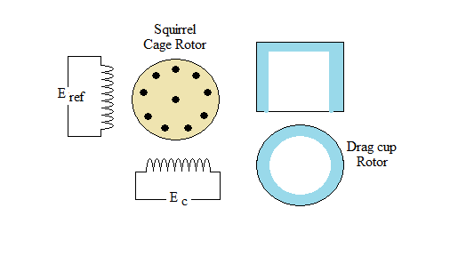

## Introduction

<b>Discipline | <b> Electrical Engineering 
:--|:--|
<b> Lab | <b> **Control and Instrumentation Laboratory**
<b> Experiment|     <b> **Determination of the incremental transfer function of an AC Servomotor**

### About the Experiment 
**Servo motors**

Servo motors (control motors) are the motors, designed and built for the use in feedback control systems. They have high speed of response and they are made for dc as well as for ac operation. These motors are usually fractional horsepower motors having low efficiency.
For low power applications in control system, ac motors are some times used for their rugged construction. Most ac motors used in control systems are of the two phase induction type, which are generally rated from a fraction of a watt upto a few hundred watts i.e., fractional horse power. The frequency of the motor is normally rated at 50, 60, 400, 500, or 1000 Hz.

<b>Fig. 1. Schematic representation of the Two Phase Induction Motor</b>

<b>Subject matter expertise | <b> **Prof. Alok Kanti Deb**
:--|:--|
<b> Institute | <b>  **Indian Institute of Technology Kharagpur**
<b> Email id|     <b>  **alokkanti@ee.iitkgp.ac.in**
<b> Department |  **Department of Electrical Engineering**
<b>Webpage| <b> http://www.iitkgp.ac.in/department/EE/faculty/ee-alokkanti

### Contributors List

SrNo | Name | VLabs Developer or Integration Engineer | Designation | Department| Institute
:--|:--|:--|:--|:--|:--|
1 | **Piyali Chattopadhyay** | Developer | Project Scientist | Department of Electrical Engineering | IIT Kharagpur | 
2 | **Subhasis Mahata** | Integration Engineer | Senior Project Scientist | Department of Mechanical Engineering | IIT Kharagpur |
